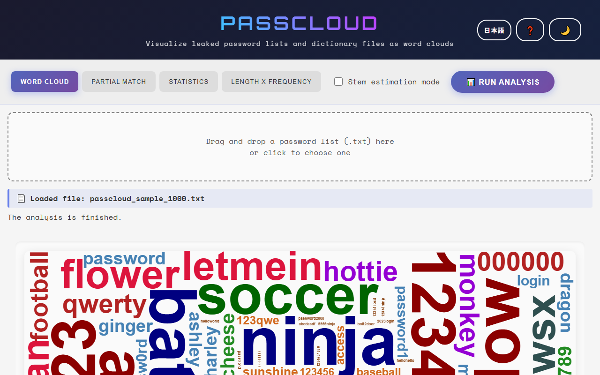
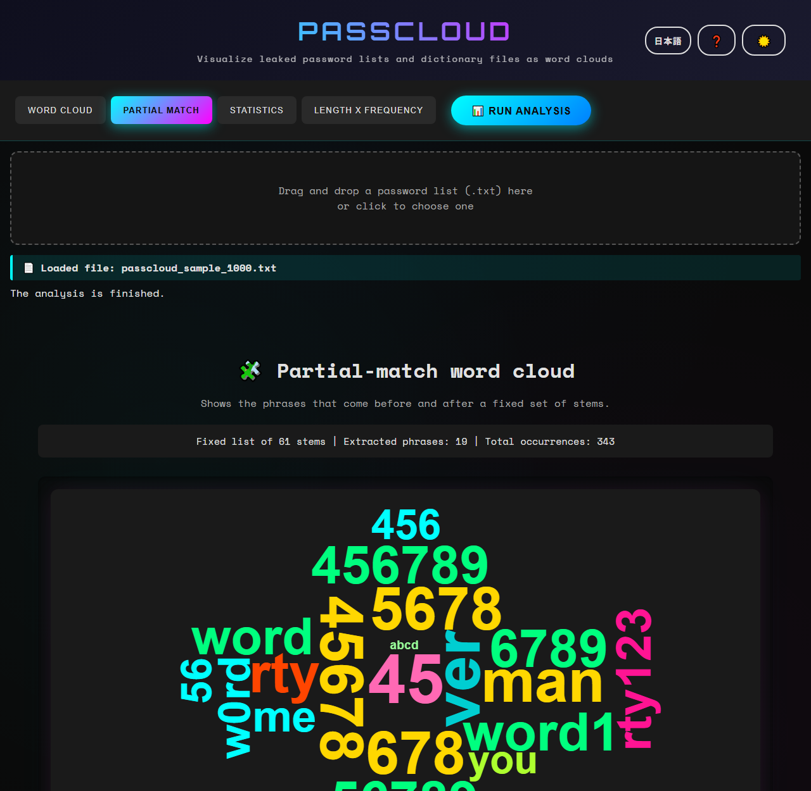
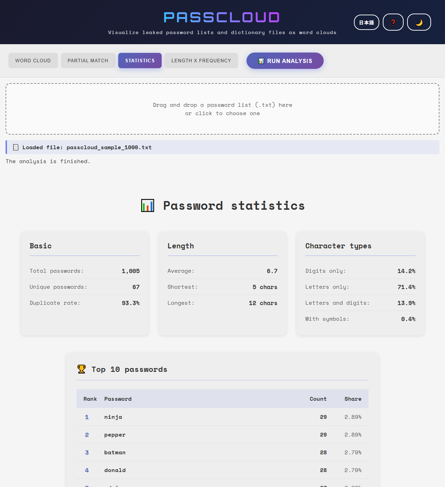
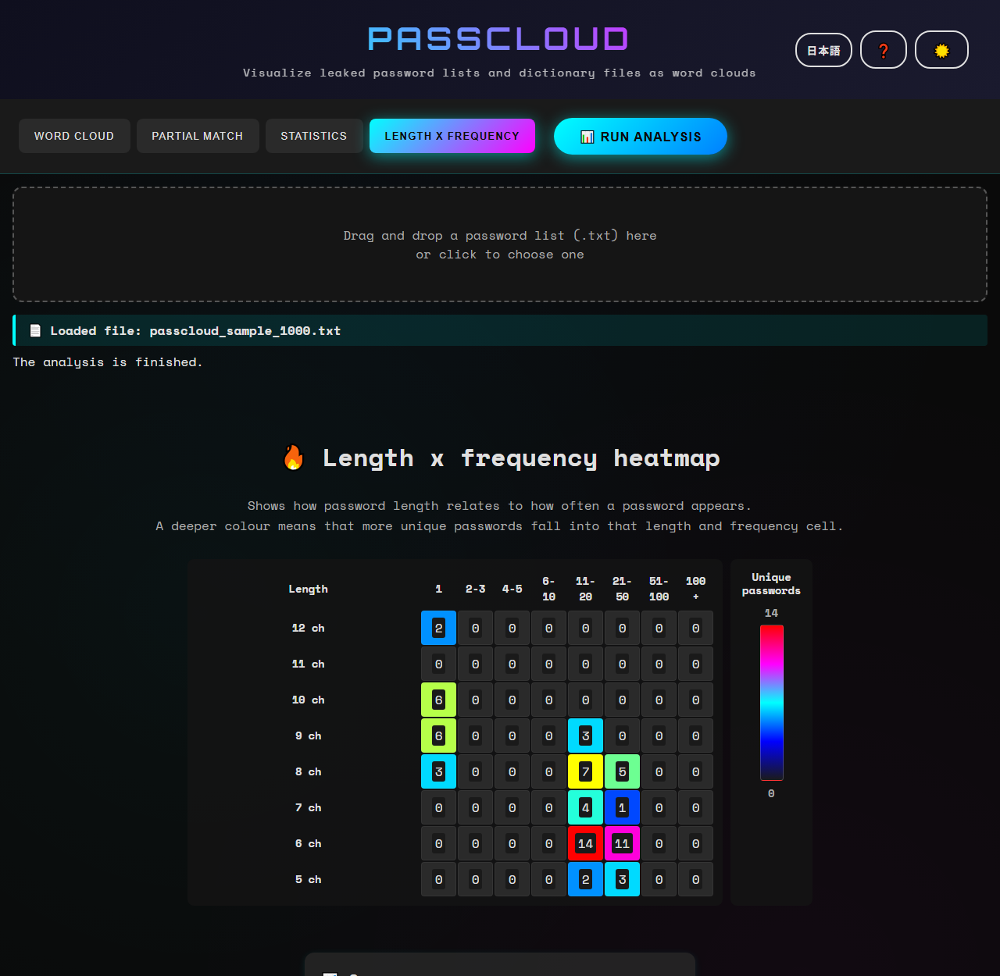

# PassCloud - Password Word Cloud Visualization Tool

English · [日本語](README.md)


[](https://ipusiron.github.io/passcloud/)

**Day019 - Security Tools 100 built with generative AI**

**PassCloud** takes a leaked password list or a dictionary file and draws it as a word cloud, so that the shape of the list can be read at a glance.

---
## 🌐 Demo

👉 [https://ipusiron.github.io/passcloud/](https://ipusiron.github.io/passcloud/)

## 📸 Screenshots


> *The bundled 1,005-line sample analyzed with stem estimation off. The button at the top right switches back to Japanese.*


> *The 19 phrases found around the 61 fixed stems, in the dark theme.*


> *1,005 entries, 67 unique, average length 6.7. The top entry is ninja with 29 occurrences.*


> *The cell for 6 characters and 11-20 occurrences holds 14 of them, the deepest of the grid. Dark theme.*

---

## ✨ Features

PassCloud looks at a leaked password list or a dictionary file from four angles.

- Word cloud
- Partial-match word cloud
- Statistics
- Length x frequency heatmap

The interface also switches between **Japanese and English**.

---

### 🌥 Word cloud

Draws the words that appear most often in the list, using font size and colour depth.
The patterns in common use stand out at a glance.

- The cloud is built from how often each entry occurs
- **Stem estimation mode (on/off)** normalizes each entry
  - For example, `password123` becomes `password`
- Lopsided habits in the list become visible

---

### 🧩 Partial-match word cloud

Takes the passwords that contain one of the common stems (`pass`, `admin`, `love` and so on) and draws **the phrases that are used together with the stem**.

- A fixed list of 61 stems, matched anywhere inside the password
- The prefixes and suffixes around the stem are extracted and counted
- The combinations that are easy to guess become visible

---

### 📊 Statistics

Shows the character of the whole list as numbers.

- Total entries and unique entries
- The shortest and the longest entry, with their lengths
- The most frequent password and its count
- Average length
- The share of digits, letters and symbols
- A table of the ten most frequent entries

---

### 🔥 Length x frequency heatmap

Shows how the **length** of a password relates to **how often it appears**, as a two-dimensional matrix.

- Vertical axis: the range of lengths decided from the words of 20 characters or fewer. Words of 21 characters or more are reported as a unique count and a total count, outside the table
- Horizontal axis: bands of frequency (1, 2-3, 4-5, and so on)
- Cell colour: deeper means more unique passwords in that cell (red is many, blue is few)

Habits such as **"short and very common"** or **"concentrated at one length"** show up immediately.

---

## 📁 Input format

- A UTF-8 `.txt` file
- **One password (or dictionary word) per line**
- Up to 10MB, and about 10,000 lines at most (it depends on the browser)
- Case is ignored when entries are counted
- Surrounding spaces are trimmed and blank lines are not counted
- An invisible control character such as RLO (U+202E) is rewritten as `[U+202E]`, for display only

---

## 📖 How to use it

1. Open `index.html` in a browser, or open the demo page.
2. Drag and drop a password list (a `.txt` file), or click to choose one.
3. Press the "📊 Run analysis" button.
4. Use the tabs to read the word cloud, the statistics and the heatmap.
5. Use the "日本語" button at the top right to switch the language (`?lang=ja` also works).

---
### 📁 Sample file
- Load `sample/passcloud_sample_1000.txt` to try the tool out.

---
### 📦 Bundled library and fonts

`wordcloud2.js` is bundled in the repository, so there is no CDN dependency.
The web fonts live in `assets/fonts/`, so opening the page makes zero external requests.

---
## 🔧 Preparing a password file to analyze 【advanced】

Most password files distributed on the internet are already tidied up: sorted, with duplicates removed.
Tidying makes the file smaller, and a dictionary attack is easier to run against the tidied form.

A tidied file can still be analyzed here, but the word cloud — the main view — does not work well on it, because the duplicates that give each word its weight are gone.
Turning stem estimation on recovers some of the shape.

In other words, a **raw leaked password file that still holds its duplicates** is what this tool is built for.

There are a few ways to obtain such a file.

- Obtain a raw leaked password file.
- Obtain an encrypted password file (captured yourself, or downloaded) and recover it with a password cracker.

---

### Extracting the 5,000 most frequent lines (using rockyou.txt)

The commands below take the 5,000 most frequent lines out of `rockyou.txt`, which still holds its duplicates.

```bash
# 1. Sort the passwords and count the occurrences
sort rockyou.txt | uniq -c | sort -nr > freq_sorted.txt

# 2. Keep the top 5,000 (with the counts still attached)
head -n 5000 freq_sorted.txt > top5000_with_freq.txt

# 3. Drop the counts and keep the passwords only (the form PassCloud reads)
awk '{$1=""; print substr($0,2)}' top5000_with_freq.txt > passcloud_sample_top5000.txt
```

---

## 🔬 How it works

Counting the input and drawing it are kept apart.
The word cloud is handed a copy of every tuple, so the shrink-to-fit pass never changes the counts it was given.
The top 10 is sorted by count descending, and lexically ascending when counts tie.

### Stem estimation examples

Only trailing digits and symbols are stripped, and a word that would become empty keeps its original form.
Digits inside a word are left alone.

| Input | After stem estimation |
|---|---|
| password123 | password |
| p4ssw0rd | p4ssw0rd |
| 123456 | 123456 |
| iloveyou2 | iloveyou |

### Analysis of the bundled sample

The values below come from the bundled sample with stem estimation off.
Length is counted in JavaScript string length (UTF-16 code units).

| Statistic | Value |
|---|---|
| Total passwords | 1005 |
| Unique | 67 |
| Duplicate rate | 93.3% |
| Average length | 6.7 |
| Shortest | 5 |
| Longest | 12 |
| Digits only | 14.2% |
| Letters only | 71.4% |
| Letters and digits | 13.9% |
| With symbols | 0.4% |
| Runs of digits or letters | 20.1% |
| Keyboard rows | 6.2% |
| Contains a year | 0.2% |

| Top 10 | Password | Count | Share |
|---|---|---|---|
| 1 | ninja | 29 | 2.89% |
| 2 | pepper | 29 | 2.89% |
| 3 | batman | 28 | 2.79% |
| 4 | donald | 28 | 2.79% |
| 5 | admin | 27 | 2.69% |
| 6 | shadow | 27 | 2.69% |
| 7 | 12345 | 26 | 2.59% |
| 8 | abc123 | 26 | 2.59% |
| 9 | summer | 25 | 2.49% |
| 10 | 1qaz2wsx | 24 | 2.39% |

| Length | Total occurrences | Share |
|---|---|---|
| 5 | 110 | 10.9% |
| 6 | 509 | 50.6% |
| 7 | 89 | 8.9% |
| 8 | 228 | 22.7% |
| 9 | 61 | 6.1% |
| 10 | 6 | 0.6% |
| 12 | 2 | 0.2% |

### The heatmap counts

Each cell counts unique words. The most common length is 6 characters (509 occurrences in total), the most common band is 11-20, the largest cell is 14, and 0 unique words were excluded.
When every word falls outside the range that can be shown, the table is replaced by the excluded counts.

| Length | 1 | 2-3 | 4-5 | 6-10 | 11-20 | 21-50 | 51-100 | 100+ |
|---|---|---|---|---|---|---|---|---|
| 5 | 0 | 0 | 0 | 0 | 2 | 3 | 0 | 0 |
| 6 | 0 | 0 | 0 | 0 | 14 | 11 | 0 | 0 |
| 7 | 0 | 0 | 0 | 0 | 4 | 1 | 0 | 0 |
| 8 | 3 | 0 | 0 | 0 | 7 | 5 | 0 | 0 |
| 9 | 6 | 0 | 0 | 0 | 3 | 0 | 0 | 0 |
| 10 | 6 | 0 | 0 | 0 | 0 | 0 | 0 | 0 |
| 11 | 0 | 0 | 0 | 0 | 0 | 0 | 0 | 0 |
| 12 | 2 | 0 | 0 | 0 | 0 | 0 | 0 | 0 |

### The partial-match counts

Around every hit of the 61 fixed stems, phrases of at most 8 characters are extracted.
Phrases made of a single repeated character, and the stems themselves, are dropped; the 200 most frequent phrases that occur at least twice are shown.
A password can be counted through several stems and several hit positions, so the total is not the number of input lines.
For the bundled sample, 19 phrases were extracted, 343 occurrences in total.

| Partial-match phrase | Count |
|---|---|
| 45 | 26 |
| ver | 24 |
| 45678 | 22 |
| 5678 | 22 |
| 678 | 22 |
| man | 22 |
| rty | 20 |
| 456789 | 19 |
| 56789 | 19 |
| 6789 | 19 |

## 🔒 Security and privacy

Everything runs inside the browser, and the input is never sent anywhere.
The library and the web fonts are bundled, so opening the page makes zero external requests.
Passwords, extracted phrases and distributions are never written to the console, and the only things kept in localStorage are the theme and the chosen language.
The top 10 and the word cloud print the passwords as they are, so take care when sharing or photographing the screen.

### How invisible control characters are handled

A password that holds RLO (U+202E, right-to-left override) **is drawn in a different order than it is stored.**
For example `pass` + RLO + `drowssap` reads as `passpassword` when it is drawn as it is.
In a tool built for reading passwords, that means the reader copies down the wrong string.

So wherever the input is put in front of the reader, a control character is rewritten as `[U+202E]` first.
That covers the top 10 table, the word cloud, the partial-match phrases and the name of the loaded file.
The substitution happens **at the moment of display only**; lengths, counts and frequencies are still measured on the original string.
The top 10 cells and the file name line also carry `unicode-bidi: bidi-override` in CSS, so that strong right-to-left letters stay in stored order.

The heatmap prints lengths and counts only, so it never touches the input text.
Reordering inside a canvas cannot be turned off, so the word cloud is handled by removing the control characters instead.

The CSP limits scripts, styles and fonts to the same origin and forbids network access with `connect-src 'none'`.
`base-uri 'none'`, `form-action 'none'` and `object-src 'none'` are set as well, and no inline event attribute or style attribute is used.
`referrer` is `no-referrer`.
Note that `frame-ancestors` cannot be applied through a meta element.

## 📏 Font size in the word cloud

A word is sized in proportion to how often it appears, but the size is clipped at both ends.

wordcloud2 measures each word on an offscreen canvas three times as tall as the font size,
and reads its shape back with `getImageData`.
Once that canvas grows too large, Chrome drops its contents without raising anything.
So the upper clip keeps the area under 2^28 pixels even for the longest word in the list,
and the height of the drawing area caps it further.

The lower clip exists because wordcloud2 draws nothing at or below `minSize`.
Without it, a word that appears once disappears in silence (in a dictionary file with the duplicates removed, that is every word).
Words appearing twice or more keep exactly the size they had.

The number of words actually placed is counted through `wordclouddrawn`,
and the status line says so when none of them fitted, or when some were left out.

## ⚠️ Cautions

- This tool is built for education and research. Confirm that you are allowed to analyze the file.
- A large input costs processing time and memory. Even inside the 10MB limit, about 10,000 lines is a sensible target.
- Stem estimation follows a fixed rule; it is not linguistic stemming.

## 🧪 Tests

Run `npm test` with Node 22 or newer. No package has to be installed.
GitHub Actions runs the same tests on every push and pull request.
Besides the counts for the bundled sample and the boundary cases, the tables, the examples, the images and the directory tree in the README are all verified.
`test/i18n.test.js` checks that the two dictionaries hold the same keys and that no Japanese was left untranslated in the HTML.
`test/control-chars.test.js` checks the substitution and that every place printing the input goes through it.
`test/wordcloud-scale.test.js` checks the font-size clipping and that a reason is shown when no word could be drawn.

## 🔗 Related book

- [*Training Dictionary Files for the Hacking Lab* (Japanese)](https://akademeia.info/?page_id=22508)
    - p.32, 3.5 "How a dictionary file is built"
    - p.39, chapter 4 "A look at the rockyou file"

---
## 📁 Directory structure

```
passcloud/                             # the root of the application
├── .github/                           # GitHub settings
│   └── workflows/                     # GitHub Actions workflows
│       └── test.yml                   # runs npm test on push and pull_request
├── assets/                            # screenshots and fonts
│   ├── en/                            # the screens of the English interface (used by README.en.md)
│   │   ├── screenshot.png             # the word cloud tab (light theme)
│   │   ├── screenshot2.png            # the partial-match word cloud tab (dark theme)
│   │   ├── screenshot3.png            # the statistics tab (basic values and the top 10)
│   │   └── screenshot4.png            # the length x frequency heatmap tab (dark theme)
│   ├── fonts/                         # self-hosted web fonts (so nothing is fetched)
│   │   ├── OFL-Orbitron.txt           # SIL Open Font License 1.1 for Orbitron
│   │   ├── OFL-SpaceMono.txt          # SIL Open Font License 1.1 for Space Mono
│   │   ├── orbitron-700-latin.woff2   # Orbitron Bold for headings (latin subset)
│   │   ├── spacemono-400-latin.woff2  # Space Mono Regular for body text (latin subset)
│   │   └── spacemono-700-latin.woff2  # Space Mono Bold for body text (latin subset)
│   ├── screenshot.png                 # the old screen (before the rework; not linked from the README)
│   ├── screenshot2.png                # the word cloud tab (light theme)
│   ├── screenshot3.png                # the partial-match word cloud tab (dark theme)
│   ├── screenshot4.png                # the statistics tab (basic values and the top 10)
│   └── screenshot5.png                # the length x frequency heatmap tab (dark theme)
├── css/                               # stylesheets (main.css pulls in the rest)
│   ├── base.css                       # colour variables, font faces and the shared layout
│   ├── heatmap.css                    # the look of the length x frequency heatmap
│   ├── main.css                       # the entry point that imports every stylesheet
│   ├── modal.css                      # the help dialog and the header buttons
│   ├── partial.css                    # the look of the partial-match word cloud
│   ├── stats.css                      # the look of the statistics view
│   └── wordcloud.css                  # the look around the word cloud canvas
├── js/                                # the scripts of the application
│   ├── core/                          # pure logic with no screen (read from the Node tests)
│   │   ├── heatmap-data.js            # builds the length x frequency matrix and the excluded counts
│   │   ├── partial-data.js            # extracts and counts the phrases around the stems
│   │   ├── stats-data.js              # counts, lengths, character types and patterns
│   │   ├── stems.js                   # the 61 known stems and stem estimation
│   │   └── text-processor.js          # folds the input into [password, count] pairs
│   ├── heatmap-analysis.js            # draws the heatmap and its tooltips
│   ├── i18n.js                        # the Japanese and English dictionary, and switching and applying it
│   ├── main.js                        # the screen, file input, tab switching and the theme
│   ├── partial-analysis.js            # draws the partial-match word cloud
│   ├── stats-analysis.js              # draws the statistics
│   ├── utils.js                       # shared screen helpers (canvas setup, colours, loading)
│   ├── wordcloud-analysis.js          # draws the word cloud
│   └── wordcloud2.js                  # wordcloud2.js itself (bundled; left untouched)
├── sample/                            # a sample for trying the tool out
│   └── passcloud_sample_1000.txt      # 1,005 lines holding 67 distinct passwords
├── test/                              # the automated tests that node --test runs (no dependency)
│   ├── contrast.test.js               # checks that the colours reach WCAG 4.5:1
│   ├── control-chars.test.js          # checks the substitution and where the input is printed
│   ├── format.test.js                 # checks that no file was squeezed onto one line
│   ├── heatmap.test.js                # checks the heatmap matrix and the excluded counts
│   ├── html.test.js                   # checks the CSP, meta, ids and attributes of index.html
│   ├── i18n.test.js                   # checks the two dictionaries and the untranslated Japanese
│   ├── partial.test.js                # checks the partial-match results and their counts
│   ├── readme.test.js                 # recomputes the tables and numbers in the README
│   ├── stats.test.js                  # checks the statistics and the order of the top 10
│   ├── text-processor.test.js         # checks the boundaries of loading and stem estimation
│   └── wordcloud-scale.test.js        # checks the font-size clipping and the notice when nothing was drawn
├── .gitignore                         # the Git ignore list
├── .nojekyll                          # turns Jekyll off on GitHub Pages
├── CLAUDE.md                          # the guide for AI (structure and the rules to keep)
├── LICENSE                            # the MIT license of this tool
├── README.en.md                       # this document
├── README.md                          # the Japanese documentation
├── index.html                         # the markup of the screen
└── package.json                       # the npm test definition (no dependency)
```

## 💻 Requirements

Any modern browser works.
Opening `index.html` directly in a browser works too (`file://` is fine).
To serve it instead, run the command below in the root of the repository and open `http://localhost:8000/`.

```bash
python -m http.server 8000
```

## 📄 License

This tool is under the MIT license. See [LICENSE](LICENSE).
The bundled wordcloud2.js follows the MIT notice at the top of its source, and the fonts follow the SIL Open Font License 1.1 in `assets/fonts/`.

---
## 🛠️ About this tool

This tool was built as part of the "Security Tools 100 built with generative AI" project, in which security tools are created and published over 100 days with the help of AI.

The project and the other tools are described here.

🔗 [https://akademeia.info/?page_id=42163](https://akademeia.info/?page_id=42163)
