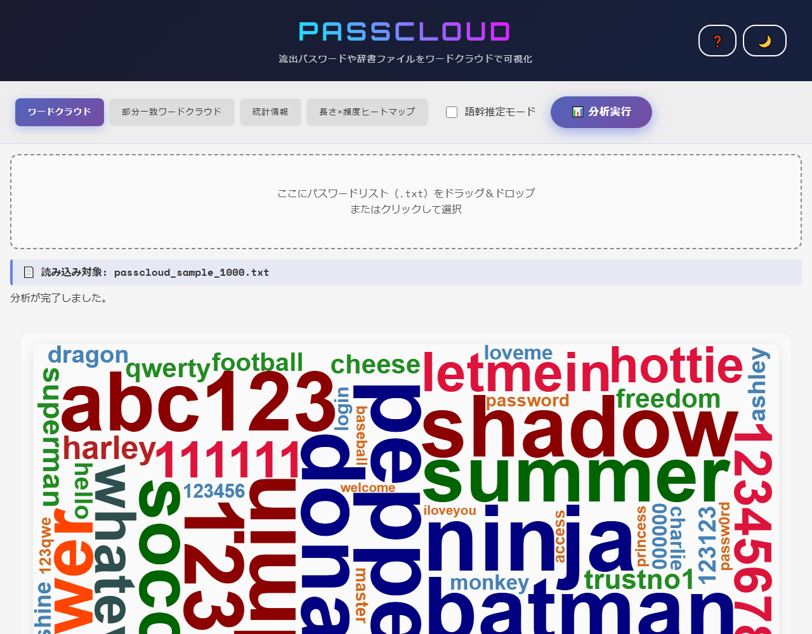
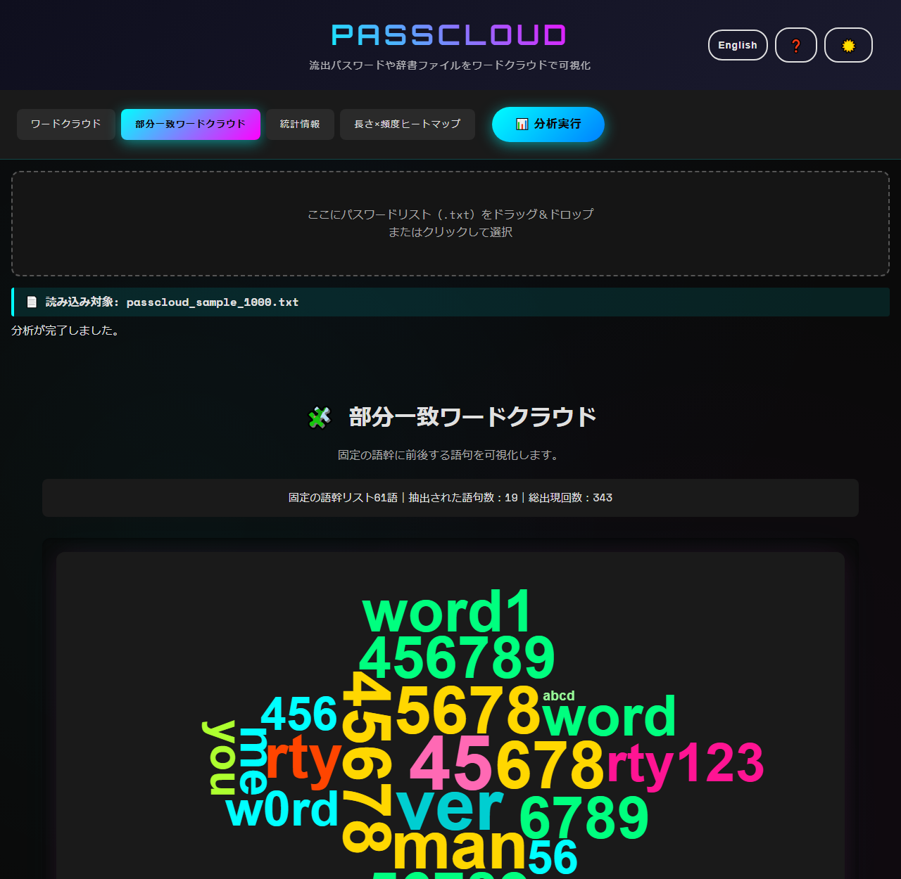
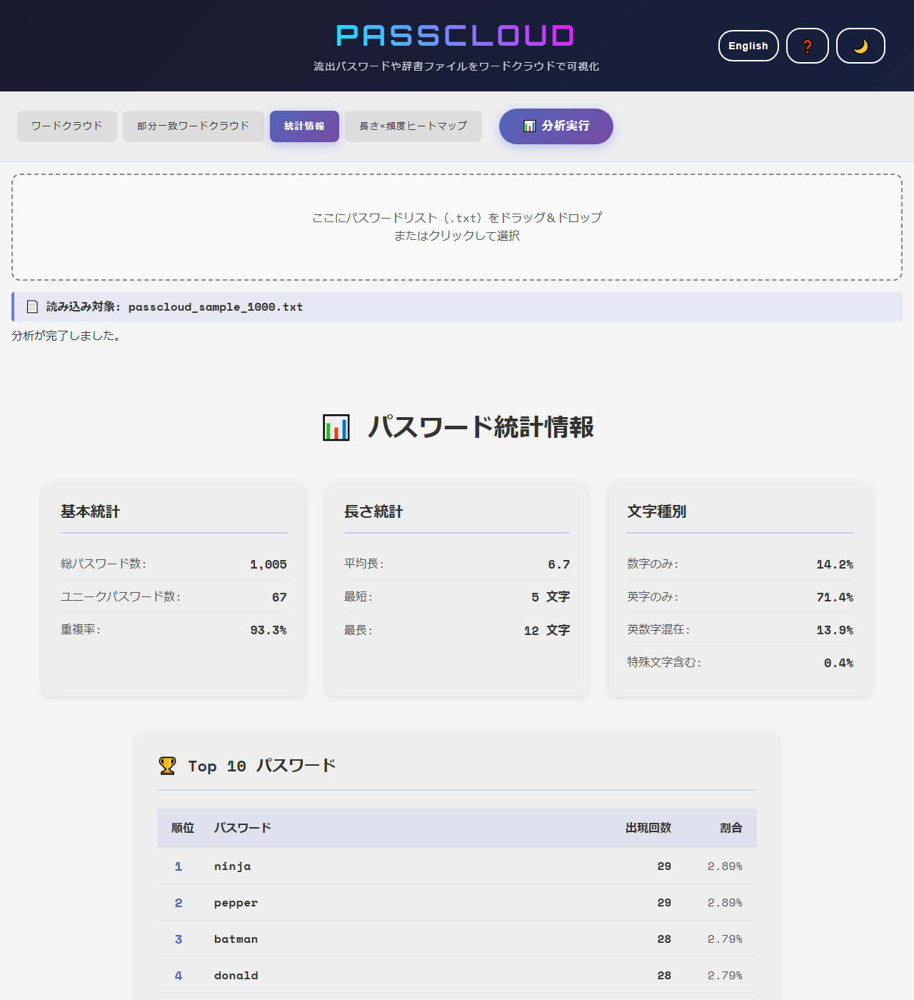
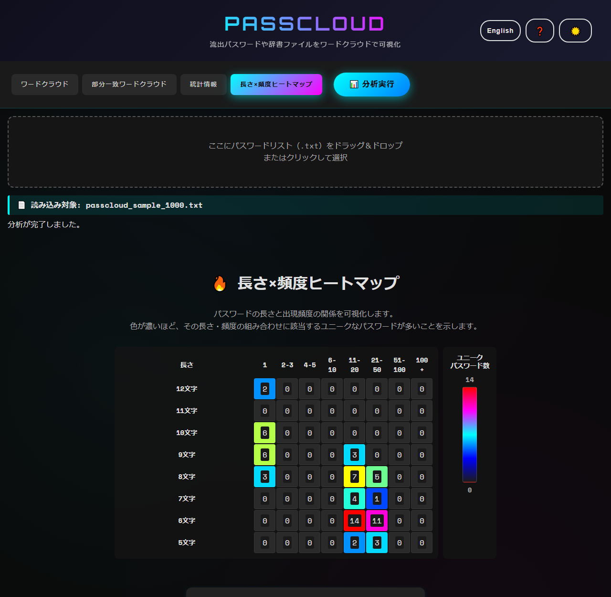

<!--
---
id: day019
slug: passcloud

title: "PassCloud"

subtitle_ja: "パスワードのワードクラウド可視化ツール"
subtitle_en: "Password Word Cloud Visualization Tool"

description_ja: "流出パスワードや辞書ファイルをワードクラウド、統計情報、ヒートマップで可視化・分析するWebツール"
description_en: "A web tool for visualizing and analyzing leaked passwords and dictionary files using word clouds, statistics, and heatmaps"

category_ja:
  - パスワード分析
  - 認証
category_en:
  - Password Analysis
  - Authentication

difficulty: 1

tags:
  - wordcloud
  - password
  - visualization
  - statistics
  - heatmap
  - client-side

repo_url: "https://github.com/ipusiron/passcloud"
demo_url: "https://ipusiron.github.io/passcloud/"

hub: true
---
-->

# PassCloud - パスワードのワードクラウド可視化ツール

[English](README.en.md) · 日本語


[](https://ipusiron.github.io/passcloud/)

**Day019 - 生成AIで作るセキュリティツール100**

**PassCloud** は、流出したパスワードリストや辞書ファイルを対象に、ワードクラウドで可視化するツールです。パスワードの傾向を視覚的に分析できます。

---
## 🌐 デモページ

👉 [https://ipusiron.github.io/passcloud/](https://ipusiron.github.io/passcloud/)

## 📸 スクリーンショット


> *サンプル1,005行を語幹推定OFFで分析したワードクラウド。ヘッダー右上の「English」で英語表示に切り替わる。*


> *固定の語幹61語に前後する19語句を抜き出したところ。ダークテーマ。*


> *総数1,005・ユニーク67・平均長6.7、Top10の先頭はninjaが29回。*


> *6文字・11-20回のセルが14種類で最も濃い。ダークテーマ。*

---

## ✨ 機能一覧

PassCloudは、流出パスワードや辞書ファイルを対象に、さまざまな視点から分析・可視化を行うWebツールです。以下の4つの分析機能を提供しています。

- ワードクラウド
- 部分一致ワードクラウド
- 統計情報
- 長さ × 頻度ヒートマップ

あわせて、画面の文言を**日本語と英語で切り替え**られます。

---

### 🌥 ワードクラウド

パスワードリスト内で出現頻度の高い単語を、フォントサイズと色の濃淡で可視化します。  
よく使われているパターンが一目で把握できます。

- 出現頻度に基づいたワードクラウド表示
- **語幹推定モード（ON/OFF）** による正規化処理が可能
  - 例：`password123` → `password`
- 視覚的に偏ったパスワード傾向を把握

---

### 🧩 部分一致ワードクラウド

よく使われる語幹（例：`pass`, `admin`, `love` など）に**部分一致**するパスワードを対象に、  
**セットで使われている語句を抽出してワードクラウド表示**します。

- 固定の語幹リスト61語と部分一致検索
- 語幹以外の前後の語句を抽出・カウント
- よく使われる「推測しやすい組み合わせ」を可視化

---

### 📊 統計情報

パスワードリスト全体の特徴を、統計データとして数値で表示します。

- 総件数、ユニーク語数
- 最短語・最長語とその文字数
- 最頻パスワードと回数
- 平均文字数
- 文字種別比率（数字／英字／記号の構成）
- 出現頻度上位10語の表形式表示

---

### 🔥 長さ × 頻度ヒートマップ

パスワードの「長さ」と「出現頻度」の関係を**2次元マトリクス**で可視化します。

- 縦軸：20文字以下の語から決めた文字数の範囲。21文字以上はユニーク数と延べ出現回数を表示対象外として報告
- 横軸：出現頻度の区間（例：1〜5回, 6〜10回, …）
- セル色：頻度の濃淡（赤＝多い、青＝少ない）

これにより、**「短くて多い」** や **「特定の長さに偏っている」** などの傾向がひと目でわかります。

---

## 📁 入力フォーマット

- UTF-8の `.txt` ファイル
- **1行に1単語（パスワードや辞書語）** が記載されていること
- ファイルサイズ上限10MB、最大10,000行程度を推奨（ブラウザー性能により異なる）
- 大文字小文字を区別せずに集計
- 各行の前後の空白を除去し、空行は数えない
- 双方向制御文字（RLO＝U+202E など）、ゼロ幅文字、制御文字、ソフトハイフン、行区切りと段落区切り、その他の書式文字は、表示のときだけ`[U+202E]`の形に置き換える
- 置き換える範囲はU+0000〜U+001F、U+007F〜U+009F、U+00AD、U+061C、U+180E、U+200B〜U+200F、U+2028〜U+202E、U+2060〜U+2064、U+2066〜U+206F、U+FEFF、U+FFF9〜U+FFFB（異体字セレクターとタグ文字は置き換えない）

---

## 📖 使い方

1. `index.html` をブラウザーで開くか、デモページにアクセスする。
2. パスワードリスト（`.txt` ファイル）をドラッグ＆ドロップ、またはクリックで選択する。
3. 「📊 分析実行」ボタンを押す。
4. 表示切替タブで、ワードクラウド／統計／ヒートマップなどを閲覧する。
5. 右上の「English」ボタンで表示言語を切り替える（`?lang=en`でも指定できる）。

---
### 📁 サンプルファイル
- `sample/passcloud_sample_1000.txt`を読み込んで動作確認できる。

---
### 📦 同梱ライブラリーとフォント

`wordcloud2.js`はリポジトリーに同梱しており、CDNには依存しません。
Webフォントも`assets/fonts/`に同梱しており、ページを開いたときの外部への通信は0件です。

---
## 🔧 分析対象のパスワードファイルを準備する 【発展編】

インターネットで配布されているパスワードファイルの多くは、すでに整形（ソート・重複カット）済みの場合がほとんどです。
なぜなら、整形することでファイル容量が減り、辞書攻撃のためには整形後のほうが使い勝手がよいためです。

整形済みのパスワードファイルや辞書ファイルも本ツールで分析できますが、主要機能であるワードクラウドは十分に機能しません。
これは、重複語が除去されているためです。
ただし、語幹推定モードをONにすることである程度の傾向は可視化できます。

つまり、重複を含む「生の流出パスワードファイル」があると、より効果的に活用できます。

こうしたファイルを得るためには、いくつかのアプローチがあります。

- 生の流出パスワードファイルを入手する。
- 暗号化されたパスワードファイル（自力で奪取 or ダウンロード）を入手し、パスワードクラッカーで解読する。

---

### 出現頻度上位5000行の生成方法（rockyou.txtを使用）

以下のコマンドで、流出パスワードのリストファイル `rockyou.txt`（重複あり）から出現頻度上位5000行を抽出できます。

```bash
# 1. パスワードをソートして、出現数をカウント
sort rockyou.txt | uniq -c | sort -nr > freq_sorted.txt

# 2. 上位5000件のみを抽出（頻度付き）
head -n 5000 freq_sorted.txt > top5000_with_freq.txt

# 3. 頻度部分を削除してパスワードだけに整形（PassCloud用）
awk '{$1=""; print substr($0,2)}' top5000_with_freq.txt > passcloud_sample_top5000.txt
```

--- 

## 🔬 技術的な説明

入力の集計と描画は分離しています。
ワードクラウドにはタプルも含めてコピーを渡すため、描画時の縮小処理で元の出現回数は変わりません。
Top10は出現回数の降順、同数なら辞書順の昇順です。

### 語幹推定の例

末尾の数字・記号だけを除き、空になる語は元の語を残します。
内部の数字は除きません。

| 入力 | 語幹推定の結果 |
|---|---|
| password123 | password |
| p4ssw0rd | p4ssw0rd |
| 123456 | 123456 |
| iloveyou2 | iloveyou |

### サンプルファイルの分析結果

同梱サンプルを語幹推定OFFで分析した値です。
長さはJavaScriptの文字列長（UTF-16コード単位）で数えます。

| 統計項目 | 値 |
|---|---|
| 総パスワード数 | 1005 |
| ユニーク | 67 |
| 重複率 | 93.3% |
| 平均長 | 6.7 |
| 最短 | 5 |
| 最長 | 12 |
| 数字のみ | 14.2% |
| 英字のみ | 71.4% |
| 英数字混在 | 13.9% |
| 特殊文字含む | 0.4% |
| 連続数字 | 20.1% |
| キーボード配列 | 6.2% |
| 年号含む | 0.2% |

| Top10順位 | パスワード | 出現回数 | 割合 |
|---|---|---|---|
| 1 | ninja | 29 | 2.89% |
| 2 | pepper | 29 | 2.89% |
| 3 | batman | 28 | 2.79% |
| 4 | donald | 28 | 2.79% |
| 5 | admin | 27 | 2.69% |
| 6 | shadow | 27 | 2.69% |
| 7 | 12345 | 26 | 2.59% |
| 8 | abc123 | 26 | 2.59% |
| 9 | summer | 25 | 2.49% |
| 10 | 1qaz2wsx | 24 | 2.39% |

| 長さ | 延べ出現回数 | 割合 |
|---|---|---|
| 5 | 110 | 10.9% |
| 6 | 509 | 50.6% |
| 7 | 89 | 8.9% |
| 8 | 228 | 22.7% |
| 9 | 61 | 6.1% |
| 10 | 6 | 0.6% |
| 12 | 2 | 0.2% |

### ヒートマップの集計

セルはユニークな語の数です。最も多い長さは6文字（延べ509回）、最頻出の頻度帯は11-20、最大セル値は14、除外は0種類です。
表示対象がすべて21文字以上の場合は、表を表示せず除外件数を示します。

| 長さ | 1 | 2-3 | 4-5 | 6-10 | 11-20 | 21-50 | 51-100 | 100+ |
|---|---|---|---|---|---|---|---|---|
| 5 | 0 | 0 | 0 | 0 | 2 | 3 | 0 | 0 |
| 6 | 0 | 0 | 0 | 0 | 14 | 11 | 0 | 0 |
| 7 | 0 | 0 | 0 | 0 | 4 | 1 | 0 | 0 |
| 8 | 3 | 0 | 0 | 0 | 7 | 5 | 0 | 0 |
| 9 | 6 | 0 | 0 | 0 | 3 | 0 | 0 | 0 |
| 10 | 6 | 0 | 0 | 0 | 0 | 0 | 0 | 0 |
| 11 | 0 | 0 | 0 | 0 | 0 | 0 | 0 | 0 |
| 12 | 2 | 0 | 0 | 0 | 0 | 0 | 0 | 0 |

### 部分一致の集計

固定の語幹リスト61語に一致する箇所の前後から、長さ8文字以下の語句を抽出します。
同じ文字だけの語句や語幹自身を除き、出現回数が2回以上の上位200語句を表示します。
複数の語幹や一致箇所から数えるため、総出現回数は入力行数と一致するとは限りません。
サンプルの抽出語句は19件、総出現回数は343回です。

| 部分一致の語句 | 出現回数 |
|---|---|
| 45 | 26 |
| ver | 24 |
| 45678 | 22 |
| 5678 | 22 |
| 678 | 22 |
| man | 22 |
| rty | 20 |
| 456789 | 19 |
| 56789 | 19 |
| 6789 | 19 |

## 🔒 セキュリティとプライバシー

処理はすべてブラウザー内で完結し、入力データを外部へ送信しません。
ライブラリーとWebフォントを同梱し、ページを開いたときの外部への通信も0件です。
パスワード・抽出語句・分布はコンソールへ出力せず、localStorageに保存するのはテーマと表示言語の選択だけです。
Top10とワードクラウドにはパスワードをそのまま表示するため、画面の共有や撮影には注意してください。

### 目に見えない制御文字の扱い

RLO（U+202E、右から左への上書き）を含むパスワードは、**表示だけが並べ替わって実物と違う文字列に見えます。**
たとえば`pass`＋RLO＋`drowssap`は、素のまま描くと`passpassword`と読めてしまいます。
パスワードを読み取るためのツールでこれが起きると、利用者が誤った文字列を書き写します。

そこで、利用者が入力データを読む場所では、目に見えない文字を`[U+202E]`のように可視化してから表示します（対象の範囲は「入力フォーマット」に挙げたとおりです）。
対象はTop10の表・ワードクラウド・部分一致の語句・読み込んだファイル名です。
置き換えは**表示の直前だけ**で行い、長さ・件数・頻度の集計はもとの文字列のまま数えます。
あわせて、Top10のセルとファイル名の行はCSSで`unicode-bidi: bidi-override`を指定し、アラビア文字などの強い右書き文字が混ざっても保存順のまま読めるようにしています。

ヒートマップは長さと件数しか出さないため、入力の文字列には触れていません。
canvasに描く語はブラウザー側の並べ替えを止められないので、制御文字を取り除くことで対処しています。

CSPはスクリプト・スタイル・フォントを同一配信元に限定し、`connect-src 'none'`で通信を禁止します。
`base-uri 'none'`・`form-action 'none'`・`object-src 'none'`も指定し、インラインのイベント属性とstyle属性は使いません。
`referrer`は`no-referrer`です。
ただし、metaでは`frame-ancestors`による埋め込み制限は適用できません。

## 📏 ワードクラウドのフォントサイズ

**守っているのは「出現回数が多い語は、実際に描かれたサイズが必ず同じか大きい」ことです。**
流出パスワードリストで見たいのは「どれが突出して多いか」なので、
サイズの順位が出現回数の順位とずれたら、可視化として成り立ちません。

### 目盛りは対数

出現回数はべき分布です。回数に比例させると、上位1語だけが極端に大きくなり、残りが下限へ潰れます。
そこで、いちばん少ない語を下限、いちばん多い語を最大に置き、その間を**出現回数の対数**で割りつけます。
回数が10倍になるたびに同じ幅だけ大きくなるので、中位の語も読める大きさで残ります。

実測（描画領域1696×600ピクセル・同じ文字数の9語）:

| 出現回数 | 描かれたサイズ |
| --- | --- |
| 20,000 | 116.7px |
| 2,000 | 91.4px |
| 500 | 76.2px |
| 120 | 60.5px |
| 100 | 58.5px |
| 20 | 40.9px |
| 5 | 25.7px |
| 2 | 15.6px |
| 1 | 8.0px |

色も同じ目盛りで引きます。wordcloud2が渡してくる値ではなく、語からもとの出現回数を引き直します。

### 大きさは全語まとめて決める

最大サイズは、次の3つを同時に満たす最大値を二分探索で決めます。

- 全語のインクの面積の合計が、描画領域の面積の0.3倍に収まる
- どの語も描画領域に収まる（短いほうの辺の0.7倍を、インクの幅の上限にする）
- いちばん長い語でもオフスクリーンcanvasが壊れない

wordcloud2は語ごとに、高さがフォントサイズの3倍あるオフスクリーンcanvasを作り、`getImageData`で形を読みます。
この面積が大きすぎると、Chromeは例外を出さずにcanvasの中身を落とします。
そのため、いちばん長い語でも面積が2^28ピクセルを超えないところを上限にし、さらに描画領域の高さでも止めます。

下限は、wordcloud2が`minSize`以下の語を描かないために置いています。
下限がないと、出現1回の語が黙って消えます（重複を落とした辞書ファイルでは全語がこれに当たります）。

**全語をひとつの係数で決めるため、縮めても語どうしの比は変わりません。**
語数が少なければ最大サイズは上がるので、canvasが空白だらけにもなりません。

### `shrinkToFit`は使わない

wordcloud2の`shrinkToFit`は、入りきらなかった語だけ出現回数に3/4を掛けて置き直します。
**大きい語ほど何度も縮むので、順位が逆転します。**
実測では、出現5,000回の`letmein`が250.6ピクセル、出現20,000回の`password`が100.4ピクセルでした。
先に面積を合わせるこちらの決め方とは両立しないので切ってあります。

入りきらなかった語は縮めずに省き、描けた語の数を`wordclouddrawn`で数えて状態欄へ件数を出します。
1語も入らなかったときは、その理由（最小サイズでも描画領域に収まらない長さの語しかない）を出します。

## ⚠️ 注意

- 教育・研究目的のツール。分析するファイルの利用権限を確認する。
- 大量の入力ではブラウザーの処理時間・メモリ使用量が増える。10MBの上限内でも10,000行程度を目安にする。
- 語幹推定は固定規則であり、言語学的な語幹解析ではない。

## 🧪 テスト

Node22以上で`npm test`を実行します。依存パッケージのインストールは不要です。
GitHub Actionsでもpushとpull_requestのたびに同じテストを実行します。
同梱サンプルと境界値の集計に加え、READMEの表・例・画像・ディレクトリー構造も検証します。
日英の辞書がそろっているか、HTMLに訳し忘れが残っていないかも`test/i18n.test.js`が検証します。
制御文字の可視化と、入力を画面に出す箇所がすべてそれを通しているかは`test/control-chars.test.js`が検証します。
ワードクラウドのサイズの単調性（出現回数が多い語ほど大きいこと）、上限で飽和しないこと、`shrinkToFit`を使っていないこと、1語も描けなかったときに理由を出すことは`test/wordcloud-scale.test.js`が検証します。

## 🔗 関連図書

- [『ハッキング・ラボで遊ぶために辞書ファイルを鍛える本』](https://akademeia.info/?page_id=22508)
    - P32 3.5「辞書ファイルの作成プロセス」
    - P39 第4章「rockyouファイルを考察する」

---
## 📁 ディレクトリー構造

```
passcloud/                             # アプリケーションのルート
├── .github/                           # GitHub の設定
│   └── workflows/                     # GitHub Actions のワークフロー
│       └── test.yml                   # push と pull_request で npm test を実行する
├── assets/                            # スクリーンショットとフォント
│   ├── en/                            # 英語UIの画面（README.en.md から参照する）
│   │   ├── screenshot.png             # ワードクラウドのタブ（ライトテーマ）
│   │   ├── screenshot2.png            # 部分一致ワードクラウドのタブ（ダークテーマ）
│   │   ├── screenshot3.png            # 統計情報のタブ（基本統計・Top10）
│   │   └── screenshot4.png            # 長さ×頻度ヒートマップのタブ（ダークテーマ）
│   ├── fonts/                         # 自前ホストする Web フォント（外部への接続をなくすため）
│   │   ├── OFL-Orbitron.txt           # Orbitron の SIL Open Font License 1.1
│   │   ├── OFL-SpaceMono.txt          # Space Mono の SIL Open Font License 1.1
│   │   ├── orbitron-700-latin.woff2   # 見出し用 Orbitron Bold（latin サブセット）
│   │   ├── spacemono-400-latin.woff2  # 本文用 Space Mono Regular（latin サブセット）
│   │   └── spacemono-700-latin.woff2  # 本文用 Space Mono Bold（latin サブセット）
│   ├── screenshot.png                 # 旧版の画面（改修前。README からは参照していない）
│   ├── screenshot2.png                # ワードクラウドのタブ（ライトテーマ）
│   ├── screenshot3.png                # 部分一致ワードクラウドのタブ（ダークテーマ）
│   ├── screenshot4.png                # 統計情報のタブ（基本統計・Top10）
│   └── screenshot5.png                # 長さ×頻度ヒートマップのタブ（ダークテーマ）
├── css/                               # スタイルシート（main.css が他を読み込む）
│   ├── base.css                       # 配色の CSS 変数・フォント定義・共通レイアウト
│   ├── heatmap.css                    # 長さ×頻度ヒートマップの見た目
│   ├── main.css                       # 各 CSS を読み込む入口
│   ├── modal.css                      # ヘルプモーダルとヘッダーボタンの見た目
│   ├── partial.css                    # 部分一致ワードクラウドの見た目
│   ├── stats.css                      # 統計情報の見た目
│   └── wordcloud.css                  # ワードクラウドの canvas まわりの見た目
├── js/                                # アプリケーションのスクリプト
│   ├── core/                          # 画面に依存しない純粋なロジック（Node のテストから読む）
│   │   ├── heatmap-data.js            # 長さ×頻度のマトリクスと除外件数を計算する
│   │   ├── partial-data.js            # 語幹に前後する語句を抽出して数える
│   │   ├── stats-data.js              # 件数・長さ・文字種別・パターンの統計を計算する
│   │   ├── stems.js                   # 既知の語幹 61 語と語幹推定（末尾の数字・記号の除去）
│   │   └── text-processor.js          # 入力テキストを [パスワード, 出現回数] に畳む
│   ├── heatmap-analysis.js            # ヒートマップの描画とツールチップ
│   ├── i18n.js                        # 画面の文言の日英辞書と、切り替え・保存・適用
│   ├── main.js                        # 画面の組み立て・ファイル入力・タブ切り替え・テーマ
│   ├── partial-analysis.js            # 部分一致ワードクラウドの描画
│   ├── stats-analysis.js              # 統計情報の描画
│   ├── utils.js                       # 画面まわりの共通処理（canvas 設定・配色・ローディング）
│   ├── wordcloud-analysis.js          # ワードクラウドの描画
│   └── wordcloud2.js                  # wordcloud2.js 本体（同梱。手を加えない）
├── sample/                            # 動作確認用のサンプル
│   └── passcloud_sample_1000.txt      # 1,005 行・67 種類のパスワードリスト
├── test/                              # node --test で動く自動テスト（依存なし）
│   ├── contrast.test.js               # 配色が WCAG 4.5:1 以上かを検証する
│   ├── control-chars.test.js          # 制御文字の可視化と、入力を出す箇所を検証する
│   ├── format.test.js                 # 1 行に詰め込んだファイルがないかを検証する
│   ├── heatmap.test.js                # ヒートマップのマトリクスと除外件数を検証する
│   ├── html.test.js                   # index.html の CSP・meta・id・属性を静的に検証する
│   ├── i18n.test.js                   # 日英の辞書と HTML の訳し忘れを検証する
│   ├── partial.test.js                # 部分一致の抽出結果と件数を検証する
│   ├── readme.test.js                 # README の表と数値をコードで再計算して突き合わせる
│   ├── stats.test.js                  # 統計の数値と Top10 の並びを検証する
│   ├── text-processor.test.js         # 取り込みと語幹推定の境界値を検証する
│   └── wordcloud-scale.test.js        # サイズの単調性と、描けなかったときの知らせを検証する
├── .gitignore                         # Git の除外設定
├── .nojekyll                          # GitHub Pages の Jekyll 処理を無効にする
├── CLAUDE.md                          # AI 向けの開発ガイド（構成と守ること）
├── LICENSE                            # 本ツールの MIT ライセンス
├── README.en.md                       # 英語版のドキュメント
├── README.md                          # 本ドキュメント
├── index.html                         # 画面のマークアップ
└── package.json                       # npm test の定義（依存パッケージなし）
```

## 💻 動作環境

モダンブラウザーで利用できます。
`index.html`をそのままブラウザーで開いても動作します（`file://`可）。
配信して開く場合は、リポジトリーのルートで次のコマンドを実行し、`http://localhost:8000/`へアクセスしてください。

```bash
python -m http.server 8000
```

## 📄 ライセンス

本ツールはMITライセンスです。[LICENSE](LICENSE)を参照してください。
同梱のwordcloud2.jsはソース冒頭のMIT表記、フォントはassets/fonts/のSIL Open Font License 1.1に従います。

---
## 🛠️ このツールについて

本ツールは、「生成AIで作るセキュリティツール100」プロジェクトの一環として開発されました。 このプロジェクトでは、AIの支援を活用しながら、セキュリティに関連するさまざまなツールを100日間にわたり制作・公開していく取り組みを行っています。

プロジェクトの詳細や他のツールについては、以下のページをご覧ください。

🔗 [https://akademeia.info/?page_id=42163](https://akademeia.info/?page_id=42163)
